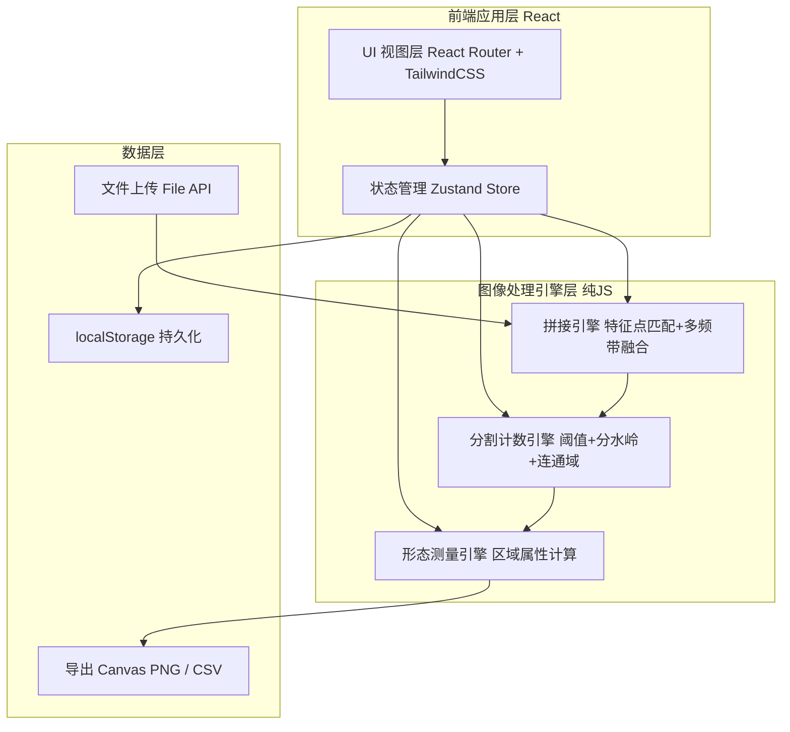
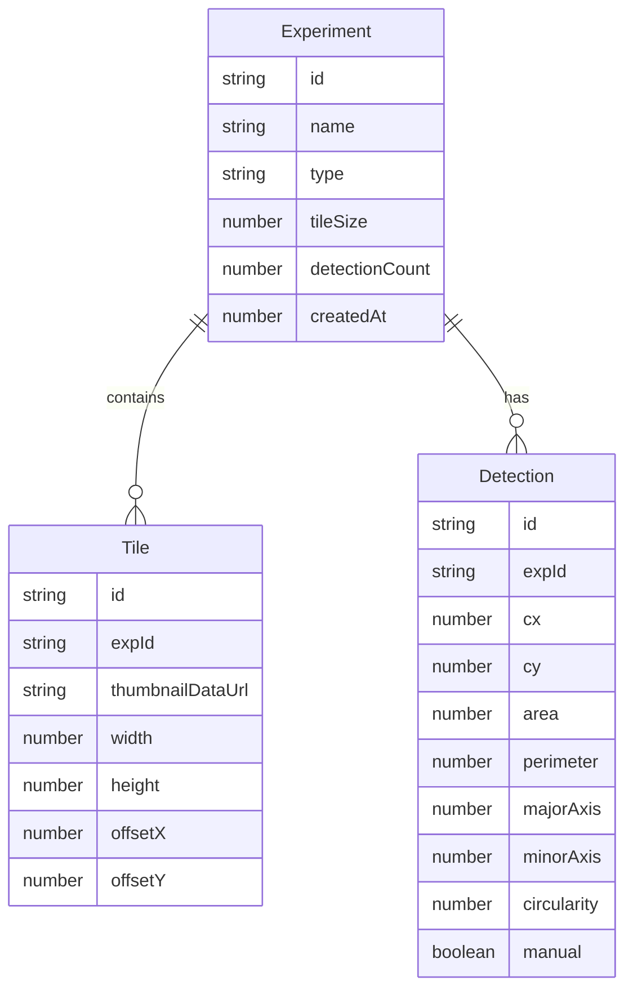

## 1. 架构设计

纯前端单页应用，所有图像处理与计算在浏览器端完成（Canvas + 自实现算法），数据通过 localStorage 持久化，保证样本隐私与离线可用。



## 2. 技术说明
- 前端：React@18 + react-router-dom@6 + tailwindcss@3 + vite
- 初始化工具：vite（npm create vite@latest）
- 状态管理：Zustand（适合工具型复杂状态）
- 图表：自绘 Canvas 直方图与柱状图（无需重型图表库）
- 图像处理：Canvas 2D API + 自实现算法（Harris 角点、归一化互相关匹配、多频带融合、自适应阈值、距离变换分水岭、连通域标记）
- 后端：无（纯客户端，实验室数据不离机）
- 数据库：无（localStorage 键值持久化实验组、计数结果、统计摘要；原始图像以压缩 dataURL 存储摘要缩略图）

## 3. 路由定义

| 路由 | 用途 |
|-------|---------|
| / | 实验工作台：实验组列表、工作流引导、样本导入 |
| /stitch/:expId | 图像拼接工作室：上传、排序、匹配、拼接、亮度均衡 |
| /count/:expId | 细胞计数工作室：自动分割、形态过滤、人工标注 |
| /measure/:expId | 测量与统计：单目标测量、分布直方图、组内汇总 |
| /compare | 对比与导出：多组对比、导出标注图像与 CSV |

## 4. 关键算法实现说明

### 4.1 图像拼接
- 对每张图执行 Harris 角点检测得到特征点
- 以参考图为基准，对相邻图用归一化互相关（NCC）匹配特征点对
- 估算图间平移位移（显微拼接以平移为主），累加得到每张图在全景画布中的绝对偏移
- 重叠区域采用多频带融合（拉普拉斯金字塔加权）消除接缝
- 重叠区亮度均衡：以参考图为直方图基准，对相邻图做直方图匹配后再融合

### 4.2 细胞分割与计数
- 灰度化 + 高斯平滑
- 自适应阈值（局部均值）或 Otsu 全局阈值生成二值图
- 形态学开运算去噪、闭运算填洞
- 距离变换 + 分水岭分离粘连细胞
- 连通域标记得到每个目标，计数

### 4.3 形态测量
对每个连通域计算：
- 面积 = 像素数；周长 = 边界像素链长
- 等效直径 = √(4·面积/π)
- 圆度 = 4π·面积 / 周长²（1 为完美圆）
- 长短轴/长短轴比 = 由二阶矩拟合椭圆得到

## 5. 数据模型

### 5.1 数据模型定义



### 5.2 数据定义语言（localStorage 键结构）

```text
KEY: mic_experiments   → Experiment[]
KEY: mic_tiles_<expId> → Tile[]
KEY: mic_detections_<expId> → Detection[]
KEY: mic_panorama_<expId> → { width, height, dataUrl }
```
